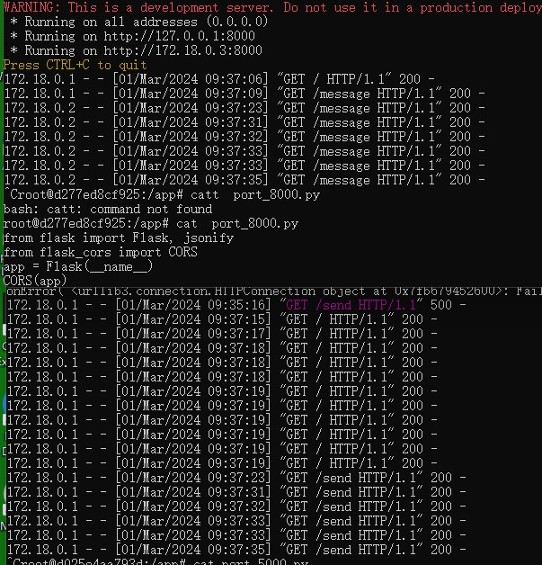
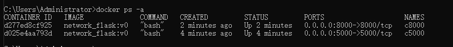

容器创建命令
```
docker run -d --name c5000  -it --network test_connect  -p 5000:5000 network_flask:v0 bash
```
**注意**
> flask里面不使用ip地址的原因是，容器重启后ip地址会有变化

1. docker的默认bridge网络容器间相互隔离，所以如果要让容器间互相通信就需要新建一个网络，然后连接到一起。
```
docker network create test_connect  # 创建docker网络
docker inspect containerID/name  #查看容器的信息
```
2. 容器内安装ping的工具命令
```
apt update # 得先更新因为你不知道容器系统的版本
apt-get install -y iputils-ping
```
3. docker 命令解析
- `--name` 作为ping ip地址的替代，也可作为 ping hostname 。`--hostname`改变的是容器内`root@hostname`的名称
- `--network`连接到docker网络的，在同一个容器网络才能通信
4. example 


